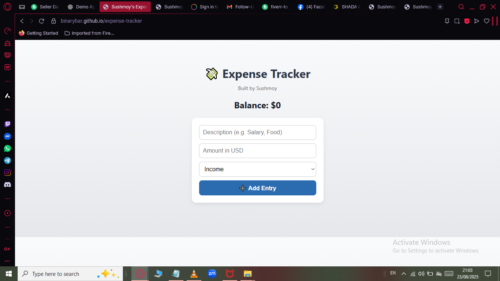

# 💸 Sushmoy’s Expense Tracker

A beginner-friendly Expense Tracker web app made with HTML, CSS, and JavaScript.  
Track your income and spending with a clean and modern interface—no backend required!

## 🚀 Features
- Add income or expense entries
- Auto-calculates your balance
- Delete entries
- Color-coded for clarity (green = income, red = expense)

## 📁 Technologies Used
- HTML5
- CSS3 (Flexbox + gradients + shadows)
- Vanilla JavaScript

## 📷 Screenshot  

## 🚀 Live Demo  
[Click here to view the app](https://binarybar.github.io/expense-tracker/)

## 📌 How to Use  

1. Enter a **transaction name** and **amount**.  
2. Click **Add** to save the transaction.  
   - Positive amounts = **Income**  
   - Negative amounts = **Expense**  
3. Your balance updates automatically.  
4. Click ❌ to delete a transaction.  

---

## 🏆 Future Improvements  

- 📅 Add date for each transaction  
- 💾 Store data in **Local Storage** so it stays after refresh  
- 📈 Add charts to visualize income vs. expenses  

---

## 👨‍💻 Built By  

**Sushmoy (BinaryBar)** 🚀  
📧 [paulsushmoy575@gmail.com](mailto:paulsushmoy575@gmail.com)  
🔗 [GitHub Profile](https://github.com/BinaryBar)  

---

Made with ❤️ by **Sushmoy Pal**

